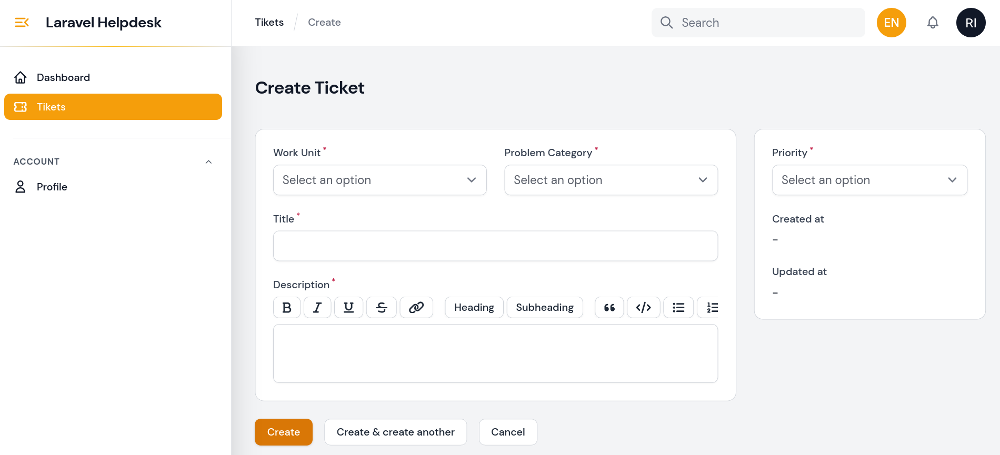
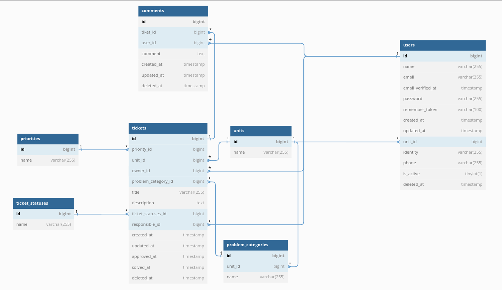
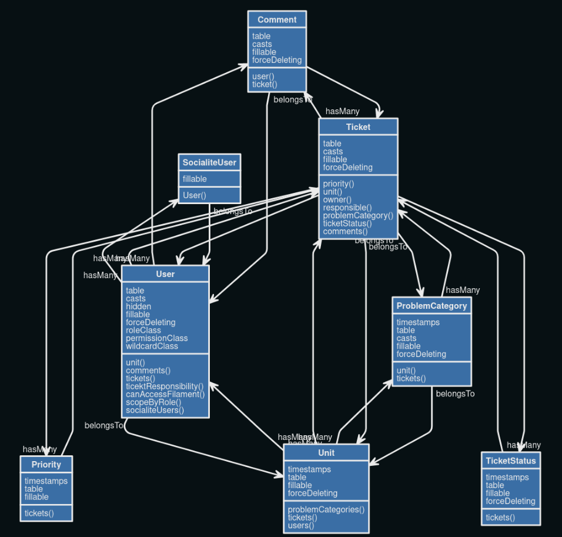
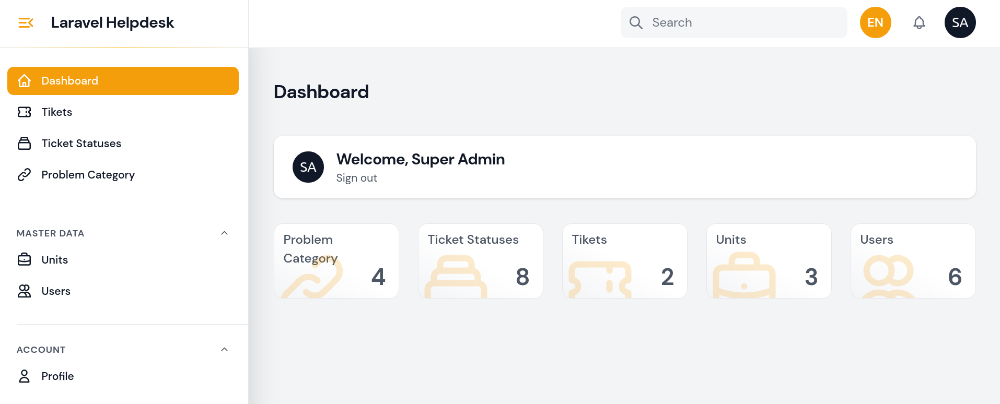

 </img> 
## Helpdesk Laravel

The Helpdesk Laravel repository is a project aimed at providing a web-based helpdesk system using the [**Laravel Framewrok v10**](https://laravel.com)   and [**Filament v2**](https://github.com/filamentphp). Helpdesk is a system that allows users to submit questions, request assistance, or report issues related to a company's products or services.

In this repository, you will find the complete source code implemented using Laravel, a popular and powerful PHP framework. This project is designed to assist web developers in building and managing helpdesk systems with ease.

The key features of Laravel Helpdesk include:
1. Ticket Submission: Users can submit new tickets containing their questions, assistance requests, or issue reports.
2. Ticket Management: Admins can view, assign, or close tickets submitted by users.
3. Ticket Prioritization: Users can prioritize their tickets to emphasize the level of urgency.
4. History and Tracking: The system records all activities and conversations within tickets, allowing for easy tracking and auditing.

This Laravel Helpdesk repository will provide a solid foundation for building a customizable and extensible helpdesk system according to your specific needs. By utilizing Laravel as the main framework, this project offers user-friendliness, flexibility, and good performance.

Feel free to explore this repository and start building a robust and responsive helpdesk application using Laravel Helpdesk!

## Database Design
 </img> 

## Unified Modeling Language (UML)
</img> 

## Requirements
* PHP 8.1 or higher
* Database (eg: MySQL, PostgreSQL, SQLite)
* Web Server (eg: Apache, Nginx, IIS)

## Installation

* Install [Composer](https://getcomposer.org/download)
* Clone the repository: `git clone https://github.com/ruswan/laravel_helpdesk.git`
* Install PHP dependencies: `composer install`
* Setup configuration: `cp .env.example .env`
* Generate application key: `php artisan key:generate`
* Create a database and update your configuration.
* Run database migration: `php artisan migrate`
* Run database seeder: `php artisan db:seed`
* Create a symlink to the storage: `php artisan storage:link`
* Run the dev server: `php artisan serve`

## Dummy Account
### Super Admin
> - Email: superadmin@example.com
> - Password: password
### Admin Unit
> - Email: adminunit@example.com
> - Password: password
### Staff Unit
> - Email: staffunit@example.com
> - Password: password
### General User
> - Email: user@example.com
> - Password: password

## Super Admin Preview
 </img> 
